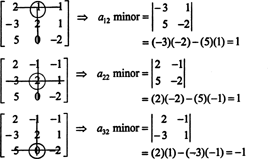
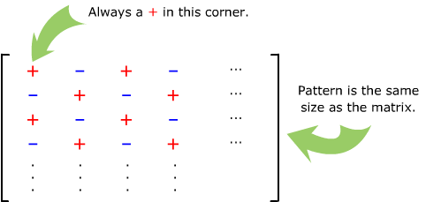

3D 용어들을 이해하는데 참조한 링크들입니다. 


#### [Matrix (행렬)](http://www.opengl-tutorial.org/beginners-tutorials/tutorial-3-matrices/)

- 행렬 곱셈

  - 왼쪽 행렬의 [열]과 오른쪽 행렬의 [행]이 같아야 곱셈이 가능하고 
  - 결과는 왼쪽 행렬의 [행] x 오른쪽 행렬의 [열]의 크기가 된다.
  - 예)  A = [2x3],  B = [3x2],  AB = [2x2]

- [Homogeneous coordinates (동차좌표계)](http://blog.daum.net/shksjy/229)

- [Identity Matrix (단위행렬)](http://rfriend.tistory.com/tag/identity%20matrix)

- [Inverse Matrix (역행렬) - Gauss elimination (가우스 소거법)](http://m.blog.naver.com/justant/20208491220)

- [Inverse Matrix - Cofactor (여인수)](http://rfriend.tistory.com/143)

- [Sarrus, Minor Determinant, Codfactor (사루스, 소행렬식, 여인수)](http://carstart.tistory.com/154)

- [소행렬식, 여인수, 행렬식, 전치행렬, 수반행렬, 역행렬](http://www.youtubemusiclyrics.com/?id=CFa_MtkFEQc)

  - 소행렬식 (Minor Determinant)

    - n차 정방행렬 A의 i행과 j열을 뺀 부분행렬의 행렬식을
      행렬 A의 원소 Aij의 소행렬식이라 하고 Mij로 표시한다.
      ​
      
      ​

  - 여인수 (Cofactor)

    - 소행렬식에 부호를 붙힌 것 (i행과 j열 일 때 ij의 합이 짝수일 때 +, 홀수일 때 -)

      
      ​

  - 행렬식 (Determinant)

    - n차 정방행렬 A = [Aij]의 행렬식은 하나의 특정 행(or 열)의 원소에
      그 원소에 대응하는 여인수를 곱한 합으로 정의하고 |A| = det(A)로 표시한다. 
      ​

      
      ​

- 수반행렬 (Adjoint Matrix )

  - n차 정방행렬 A의 여인수행렬의 [전치행렬](http://ocw.kookmin.ac.kr/?course=390)을 수반행렬이라한다.

  $$
  adj(A) = \begin{bmatrix} C_1\ _1& C_1\ _2 & C_1 \ _n \\ C_2 \ _1 & C_2 \ _2 & C_2 \ _n \\ C_m\ _1  & C_m \ _2 & C_m \ _n\end{bmatrix}^T
  $$

- 역행렬 (by [권태원 교수님](http://www.youtubemusiclyrics.com/?id=CFa_MtkFEQc))

  - 행렬 A가 아래값일 때

  $$
  A = \begin{bmatrix} 2&3&-1 \\ 1&2&0\\ 4&2&1 \end{bmatrix}
  $$

  - A의 여인수행렬 계산과정은 아래와 같고

  $$
  C_{1,1} = +\begin{bmatrix} 2 & 0 \\ 2 & 1\end{bmatrix}, C_{1,2} = -\begin{bmatrix} 1 & 0 \\ 4 & 1\end{bmatrix}, C_{1,3} = +\begin{bmatrix} 1 & 2 \\ 4 & 2 \end{bmatrix}
  $$

  $$
    C_{2,1} = -\begin{bmatrix} 3&-1 \\ 2&1 \end{bmatrix}, C_{2,2} = +\begin{bmatrix} 2&-1 \\ 4&1 \end{bmatrix}, C_{2,3} = -\begin{bmatrix} 2&3 \\ 4&2 \end{bmatrix}
  $$

  $$
    C_{3,1} = +\begin{bmatrix} 3&-1 \\ 2&0 \end{bmatrix}, C_{3,2} = -\begin{bmatrix} 2&-1 \\ 1&0 \end{bmatrix}, C_{3,3} = +\begin{bmatrix} 2&3 \\ 1&2 \end{bmatrix}
  $$

  - 아래가 결과입니다.

  $$
    C_{i,j}= \begin{bmatrix} 2&-1&-6 \\ -5&6&8 \\ 2&-1&1 \end{bmatrix}
  $$

  - 계산된 여인수행렬의 전치행렬은 (수반행렬) 다음과 같습니다.

  $$
    adj(A)  = \begin{bmatrix} 2&-5&2 \\ -1&6&-1 \\ -6&8&1 \end{bmatrix}
  $$

  - 행렬 A의 3열을 가지고 행렬식을 구하면 아래와 같습니다.

  $$
    |A| = -1\begin{bmatrix} 1&2 \\ 4&2 \end{bmatrix} + 1\begin{bmatrix} 2&3 \\ 1&2 \end{bmatrix} = 6 + 1 = 7
  $$

  - 행렬A x 행렬식 역수값 x 수반행렬을 계산해보겠습니다.

  $$
    {A} {1\over|A|}adj(A) = {1\over7}\begin{bmatrix}2&3&-1 \\ 1&2&0 \\ 4&2&1 \end{bmatrix}\begin{bmatrix}2&-5&2 \\ -1&6&-1 \\ -6&8&1 \end{bmatrix} = {1\over7}\begin{bmatrix}7&0&0\\0&7&0\\0&0&7\end{bmatrix}=\begin{bmatrix}1&0&0\\0&1&0\\0&0&1\end{bmatrix}
  $$

  - 행렬A 의 역행렬을 구하는 방법은 행렬식 역수값 x 수반행렬로 구할 수 있습니다.

  $$
  A^{-1} = {1\over|A|}adj(A) = {1\over7}\begin{bmatrix}2&-5&2\\-1&6&-1\\-6&8&1\end{bmatrix}
  $$

- [역행렬로 연립방정식 풀기](https://socialmathnet.com/2011/12/18/%EC%97%AD%ED%96%89%EB%A0%AC%EB%A1%9C-%EC%97%B0%EB%A6%BD%EB%B0%A9%EC%A0%95%EC%8B%9D-%ED%92%80%EA%B8%B0/) 

  - 2x = z = 1, -2x + 3y + 4z = -1, -5x + 5y +6z = 0 연립 방정식의 해를 역행렬을 이용해서 풀면

    $$
    \begin{bmatrix} 2&0&1 \\ -2&3&4 \\ -5&5&6 \end{bmatrix} \begin{bmatrix} x \\ y \\ z \end{bmatrix} = \begin{bmatrix} 1 \\ -1 \\ 1 \end{bmatrix} 이므로 \begin{bmatrix} x \\ y \\ z \end{bmatrix} = {\begin{bmatrix} 2&0&1 \\ -2&3&4 \\ -5&5&6 \end{bmatrix}}^{-1} \begin{bmatrix} 1 \\ -1 \\ 0 \end{bmatrix}
    $$

- [Singular, Nonsingular, Determinant, det (특이행렬, 정칙행렬, 행렬식)](http://rfriend.tistory.com/142)

- [행렬식 (Det) 의미](http://scieng.net/tech/18754)

  - 선형대수에서 해를 구한다는 건
    Ax=B의 식을 A:B 매트릭스로 바꿔 푸는데, 
    A의 inverse가 존재하지 않으면 x값을 구할수가 없습니다. 
    그런데 Det가 0이면 inverse가 존재하지 않습니다. x의 값이 0인 경우를 제외하구요. 
    따라서 Det=0이면 해가 존재하지 않는다는 명제도 참이됩니다.

  ​


#### [3D Software Engine](https://www.davrous.com/2013/06/13/tutorial-series-learning-how-to-write-a-3d-soft-engine-from-scratch-in-c-typescript-or-javascript/)

- [컴퓨터 그래픽스에서 행렬을 사용해야하는 이유](http://backga.tistory.com/19)

- Transform Matrix

  - [Affine transformations](http://slideplayer.com/slide/9723655/)

  - [이동, 크기, 회전 변환](http://blog.naver.com/atom723/190307943)

  - [게임 수학](https://pt.slideshare.net/QuentinKang/1-52920181?nomobile=true)

  - [Transform Matrix in Flash](http://www.senocular.com/flash/tutorials/transformmatrix/) 

    - ActionScript 에서 Transform Matrix

    $$
    \begin{bmatrix} a&b&u \\ c&d&v \\ tx&ty&w \end{bmatrix} \begin{bmatrix} scale_x&skey_y&0(u) \\ skew_x&scale_y&0(v) \\ position_x&postion_y&1(w) \end{bmatrix}
    $$

    - 변환 행렬 수식

    $$
    x' = x * a + y * c + tx \\ y' = x * b + y * d + ty
    $$

    - 이동 변환 translation(tx, ty)

    $$
    \begin{bmatrix} 1&0&0 \\ 0&1&0 \\ 5&10&1\end{bmatrix}
    $$

    $$
    방정식으로 계산하면
    $$

    $$
    x' = 1 * x + 0 * y + 5 \\ y' = 0 * x + 1 * y + 10
    $$

    $$
    x' = x + 5 \\ y' = y + 10
    $$

    $$
    행렬로 계산하면
    $$

    $$
    \begin{bmatrix} x'&y'&1\end{bmatrix} = \begin{bmatrix} x&y&1 \end{bmatrix} \begin{bmatrix} 1&0&0 \\ 0&1&0 \\ 5&10&1 \end{bmatrix}
    $$

    ​

    - 크기 변환 scale(sx, sy)

    $$
    \begin{bmatrix} 2&0&0 \\ 0&1&0 \\ 0&0&1 \end{bmatrix}
    $$

    $$
    x' = 2 * x + 0 * y + 0 \\ y' = 0 * x + 1 * y + 0
    $$

    $$
    x' = 2x \\ y' = y
    $$

    {: .align-center}

    - 회전 변환 rotation(q)

    $$
    \begin{bmatrix} cos(q)&sin(q)&0 \\ -sin(q)&cos(q)&0 \\ 0&0&1 \end{bmatrix}
    $$

    $$
    x' = cos(30) * x - sin(30) * y + 0 \\ y' = sin(30) * x + cos(30) * y + 0
    $$

    $$
    x' = 0.87 * x - 0.5 * y \\ y' = 0.5 * x + 0.87 * y
    $$

    $$
    실제 좌표 (4, 0) 을 주고 rotation 30도를 시키면 결과값은 (3.5, 2) 가 나옵니다.
    $$

    {: .align-center}
    $$
    x' = 0.87 * 4 - 0.5 * 0 \\ y' = 0.5 * 4 + 0.87 * 0
    $$

    $$
    x' = 3.48 \\ y' = 2
    $$

    $$
    행렬로 계산 과정을 표시하면
    $$

    $$
    \begin{bmatrix} x'&y'&1 \end{bmatrix} = \begin{bmatrix} 4&0&1 \end{bmatrix} \begin{bmatrix} cos(30)&sin(30)&0 \\ -sin(30)&cos(30)&0 \\ 0&0&1 \end{bmatrix}
    $$

    $$
    \begin{bmatrix} 4&0&1 \end{bmatrix} \begin{bmatrix} 0.87&0.5&0 \\ {-0.5}&0.87&0 \\ 0&0&1 \end{bmatrix} = \begin{bmatrix}  3.48&2&1 \end{bmatrix}
    $$

    - 기울기 shearing

    $$
    \begin{bmatrix} 1&0&0 \\ 1&1&0 \\ 0&0&1 \end{bmatrix}
    $$

    $$
    x' = 1 * x + 1 * y + 0 \\ y' = 0 * x + 1 * y + 0
    $$

    $$
    x' = x + y \\ y' = y
    $$

    {: .align-center}

    - 코드 적용

      - 이동 translate(tx:Number, ty:Number)

        - x = 5, y = 10 적용 

         ```javascript
          matrix.translate(5, 10);
         ```

        - matrix 의 tx, ty 값을 직접 변경해도 같은 결과입니다.	

         ```javascript
          matrix.tx += 5;
          matrix.ty += 10;
         ```

      - 크기 scale(sx:Number, sy:Number)

        - scaleX = 1.5, scaleY = 2 적용

         ```javascript
          matrix.scale(1.5, 2);
         ```

        - 아래와 같이 직접 변경해도 같은 결과입니다.

         ```javascript
          matrix.a *= 1.5;
          matrix.b *= 2;
          matrix.c *= 1.5;
          matrix.d *= 2;
          matrix.tx *= 1.5;
          matrix.ty *= 2;
         ```

      - 회전 rotate(angle:Number)
        - angle = Math.PI / 4 적용

         ```javascript
          matrix.rotate(Math.PI / 4);
         ```

        - 아래와 같이 직접 변경해도 같은 결과입니다.

         ```javascript
          var sin = Math.sin(Math.PI / 4);
          var cos = Math.cos(Math.PI / 4);
          var a = matrix.a;
          var b = matrix.b;
          var c = matrix.c;
          var d = matrix.d;
          var tx = matrix.tx;
          var ty = matrix.ty;
          matrix.a = a * cos - b * sin;
          matrix.b = a * sin + b * cos;
          matrix.c = c * cos - d * sin;
          matrix.d = c * sin + d * cos;
          matrix.tx = tx * cos - ty * sin;
          matrix.ty = tx * sin + ty * cos;
         ```


- 회전

  - [x, y, z축 회전](http://blog.naver.com/atom723/190307943)
    - 회전 변환은 회전하는 축을 제외한 나머지 축의 값만 변화합니다.
      - x축 회전이면 y, z 값만 변함
      - y축 회전이면 x, z 값만 변함
      - z축 회전이면 x, y 값만 변함
  - @[삼각함수 sin cos 그래프 그리기](https://www.youtube.com/watch?v=V-d4nPCCgSU) 
  - @[회전 변환](https://www.youtube.com/watch?v=aWjCDyYZpYk)
  - @[회전 행렬의 유도](https://o-tantk.github.io/posts/derive-rotation-matrix/)


- [3D 이동, 크기, 회전에 대한 정리](https://www.youtube.com/watch?v=7MVNKxIV3pI)
  - @[Quaternion (사원수)](https://www.youtube.com/watch?v=gCuOJ_vuSfY)

- [이동과 회전 그리고 확대 및 축소 행렬의 결합 순서](http://blog.naver.com/PostView.nhn?blogId=atom723&logNo=190306668&categoryNo=12&parentCategoryNo=0&viewDate=&currentPage=1&postListTopCurrentPage=&from=postList&userTopListOpen=true&userTopListCount=5&userTopListManageOpen=false&userTopListCurrentPage=1)

  - Scale(변환 행렬) x Rotation(회전 행렬) x Translate(이동 행렬)
    - [회전은 z -> x -> y 순으로 결합합니다.](https://www.youtube.com/watch?v=7MVNKxIV3pI)


- [특정점을 중심으로 물체를 회전 시키고자 할때](https://gamedev.stackexchange.com/questions/16719/what-is-the-correct-order-to-multiply-scale-rotation-and-translation-matrices-f)

    - Scale x Translate X Rotation x Object Translation

- @ 역행렬 사용 예제

  - 이동, 크기, 회전 <- 어디다 사용하는지 예제 담기


- [World, View, Projection Matrix](http://web.archive.org/web/20131222170415/http:/robertokoci.com/world-view-projection-matrix-unveiled/)
- @ [View Transform, Projection Transform (뷰변환, 투영변환)](http://blog.naver.com/PostView.nhn?blogId=atom723&logNo=190303552&categoryNo=12&parentCategoryNo=0&viewDate=&currentPage=1&postListTopCurrentPage=1&from=postList&userTopListOpen=true&userTopListCount=5&userTopListManageOpen=false&userTopListCurrentPage=1)


<br>

<br>

##### 이미지 출처

- [소행렬식](https://www.cliffsnotes.com/study-guides/algebra/linear-algebra/the-determinant/laplace-expansions-for-the-determinant)
- [여인수](http://thejuniverse.org/PUBLIC/LinearAlgebra/LOLA/laplace/minor.html)
- [행렬식](https://www.cliffsnotes.com/study-guides/algebra/algebra-ii/linear-equations-in-three-variables/linear-equations-solutions-using-determinants-with-three-variables)